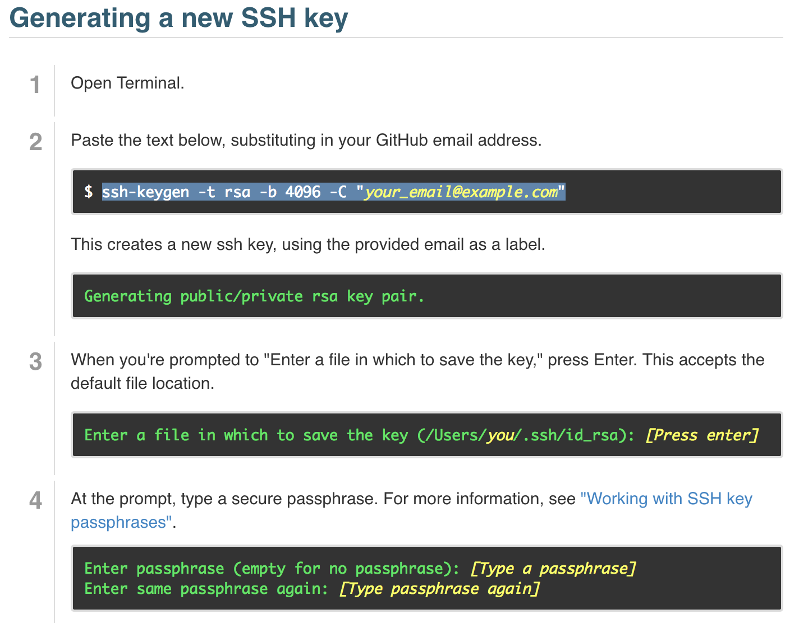
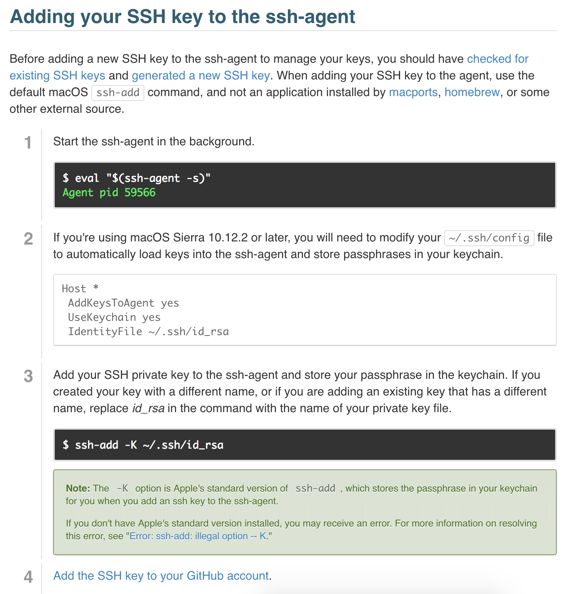
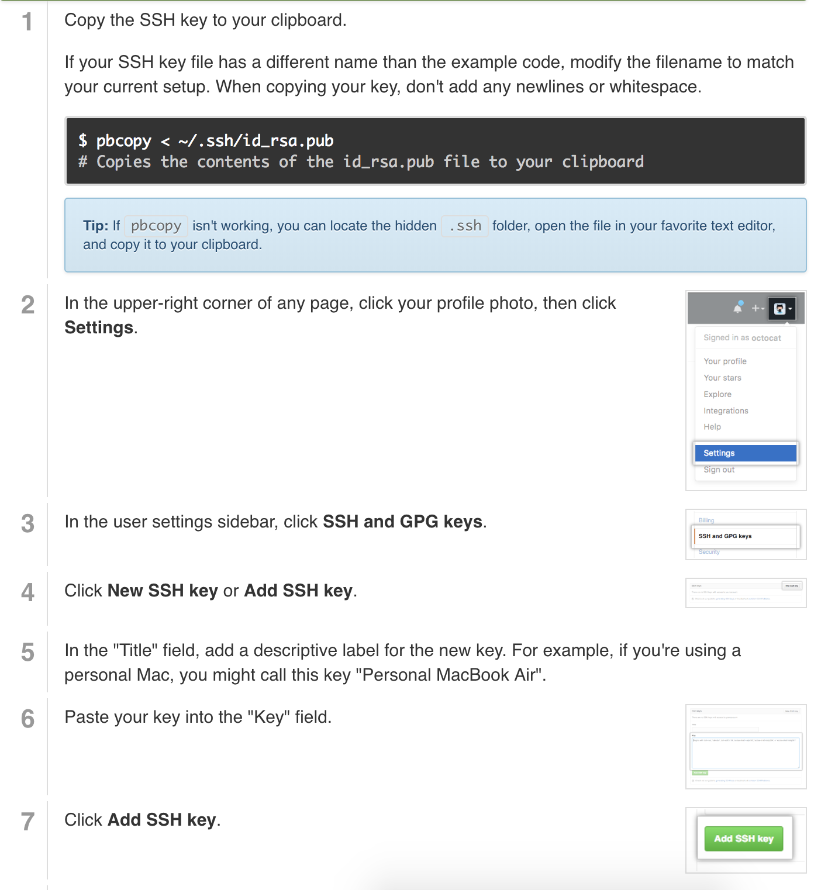

# Mac OS X Setup

## Applications

-   Google Chrome
-   Visual Studio Code
-   Atom
-   Discord
-   Slack
-   WeChat
-   WhatsApp

---

## Terminal Software

### Xcode

```
xcode-select --install
```

### Homebrew

-   Get Homebrew at [https://brew.sh](https://brew.sh/)
-   After installing Homebrew install wget

```
 brew install wget
```

### Git

```
# install git
brew install git

# makes git terminal output pretty
git config --global color.ui true

# this will mark you as the 'author' of each committed change
git config --global user.name "your name here"

# use the email associated with your GitHub account
git config --global user.email your_email_here
```

#### Generating a new SSH key





### Fonts

```
# install fonts
brew tap caskroom/fonts
brew cask install font-fira-code
brew cask install font-inconsolata
```

---

## ~/.bash_profile

Create a `.bash_profile` in home directory and insert code inside.

_More Information to Customize Terminal Color at [Marina Mele's Site](http://www.marinamele.com/2014/05/customize-colors-of-your-terminal-in-mac-os-x.html)_

```
alias ga="git add"
alias gc="git commit -m"
# alias gac="git add -A && git commit -m "
alias gp="git push"
alias bsp="bundle exec rspec"
alias gca="git filter-branch -f --env-filter \"GIT_AUTHOR_NAME='Steven Inouye'; GIT_AUTHOR_EMAIL='steveninouye@msn.com'; GIT_COMMITTER_NAME='Steven Inouye'; GIT_COMMITTER_EMAIL='steveninouye@msn.com';\" HEAD; git remote add origin git@github.com:steveninouye/aA-W1D5.git; git pull origin master --no-edit --allow-unrelated-histories;"
export CLICOLOR=1
export LSCOLORS=hegxahdhfxegedabagacad
parse_git_branch() {
  git branch 2> /dev/null | sed -e '/^[^*]/d' -e 's/* \(.*\)/ (\1)/'
}
export PS1="\u@\h \W\[\033[32m\]\$(parse_git_branch)\[\033[00m\] $ "
PS1="\[\e[45m\]\[\e[37m\]💰 \d \A \h[\[\e[4;37m\]\u\[\e[0;37m\]\[\e[45m\]]: \w\[\e[3;37m\]\[\e[45m\]\$(parse_git_branch)💰\[\e[0m\]\n💰"
source ~/.bashrc
```

Run `.bash_profile`. In terminal run

```
source ~/.bash_profile
```

---

## Terminal

```
# terminal default colors
BACKGROUND = black
TEXT = flora
BOLD TEXT = black # default
SELECTION = iron

# customize terminal color
## terminal font
Monaco 12 pt

## terminal preferences
Display ANSI colors  # check the box
```
